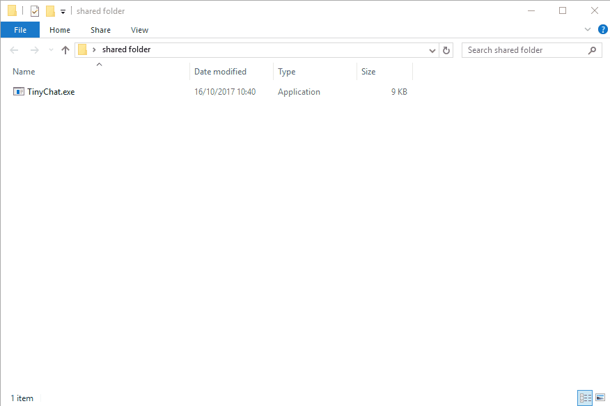

# TinyChat
Tiny chat application that works in a LAN network

# Description
What's the minimun number of lines of code do you need to write a messenger application that works in a LAN network?

That's a question I've asked my colleagues the other day, and this is my proposed solution. 

It's a 108 lines long, but I think it can be reduced even further. 

# How to use it?

Copy the exec file in a shared folder, and run it from there.

The app creates a temporary .txt file containing the chat lines and monitors its changes to show other users messages.

The application first asks for a nick name, and then enters in display mode, to show the conversation lines. 

In order to enter in the write mode, press any key and start typing. Hit enter to send the message. 

